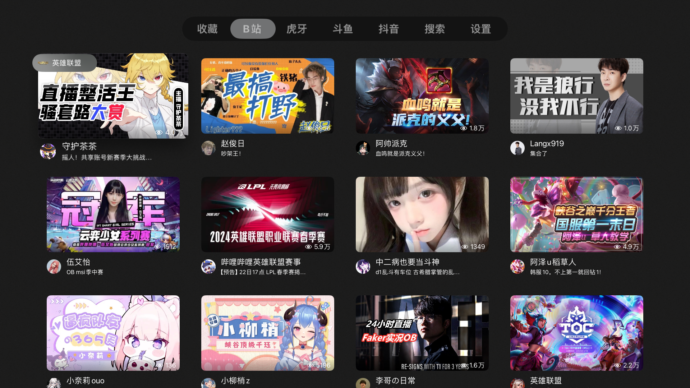

# SimpleLiveTVOS

## 下载地址：

[https://testflight.apple.com/join/2oZuwSHJ](https://testflight.apple.com/join/2oZuwSHJ) `Testflight安装链接`

## 问题反馈

[Telegram](https://t.me/+N1BDeo05leU0OWVl) 或 [提交issue](https://github.com/pcccccc/SimpleLiveTVOS/issues/new/choose)

## 截图：

  

  

## 背景：

遇到一个非常好的项目:  [dart_simple_live](https://github.com/xiaoyaocz/dart_simple_live/) `原项目`

原项目基于Flutter制作，不支持tvOS端，于是作为一个原项目的补充。

## 支持平台：

tvOS 17+ 

## 开发环境配置：

1. **克隆项目**：
   ```bash
   git clone https://github.com/pcccccc/SimpleLiveTVOS.git
   cd SimpleLiveTVOS
   ```

2. **配置 API Keys**：
   - 首次克隆后，在 `SimpleLiveTVOS/Other/Info.plist` 中将 `YOUR_BUGSNAG_API_KEY_HERE` 替换为你的 Bugsnag API key
   - Git 配置了自动过滤器，提交时会自动将真实 API key 替换为占位符

3. **打开项目**：
   使用 Xcode 打开 `SimpleLiveTVOS.xcodeproj`

4. **运行项目**：
   选择 Apple TV 模拟器或真机设备运行

## 各平台功能概览：

|  平台   | 分类列表 | 房间列表 | 地址解析 | 搜索 | 分享码/链接 | 观看弹幕（评论） |
| :-----: | :------: | :------: | :------: | :--: | :---------: | :--------------: |
| B站直播 |    ✅     |    ✅     |    ✅     |  ✅   |      ✅      |        ✅         |
|  斗鱼   |    ✅     |    ✅     |    ✅     |  ✅   |      ✅      |        ✅         |
|  虎牙   |    ✅     |    ✅     |    ✅     |  ✅   |      ✅      |        ✅         |
|  抖音   |    ✅     |    ✅     |    ✅     |  ✅   |      ✅      |        ✅         |
|  快手   |    ✅     |    ✅     |    ✅     |  ❌   |      ✅      |        ❌         |
|   YY    |    ✅     |    ✅     |    ✅     |  ✅   |      ✅      |        ❌         |
| 网易CC  |    ✅     |    ✅     |    ✅     |  ✅   |      ✅      |        ❌         |
| Youtube |    ❌     |    ❌     |    ✅     |  ❌   |      ✅      |        ❌         |


## 参考&引用：

[dart_simple_live](https://github.com/xiaoyaocz/dart_simple_live/) `原项目`  [AllLive](https://github.com/xiaoyaocz/AllLive) `原作者开发的C#版本`

[iceking2nd/real-url](https://github.com/iceking2nd/real-url) `虎牙解析参考`

[DouyinLiveRecorder](https://github.com/ihmily/DouyinLiveRecorder)

[wbt5/real-url](https://github.com/wbt5/real-url)

[Lakr233/ColorfulX](https://github.com/Lakr233/ColorfulX)

[Alamofire](https://github.com/Alamofire/Alamofire)

[DanmakuKit](https://github.com/qyz777/DanmakuKit)

[GZipSwift](https://github.com/1024jp/GzipSwift)

[Kingfisher](https://github.com/onevcat/Kingfisher)

[KSPlayer](https://github.com/kingslay/KSPlayer) `FLV源播放` (目前使用LGPL版本，fork代码请退回GPL版本)

[FFMPEG](https://github.com/FFmpeg/FFmpeg)

[Shimmer](https://github.com/markiv/SwiftUI-Shimmer)

[SimpleToast](https://github.com/sanzaru/SimpleToast)

[Starscream](https://github.com/daltoniam/Starscream)

[SWCompression](https://github.com/tsolomko/SWCompression)

[AcknowList](https://github.com/vtourraine/AcknowList)

[YouTubeKit](https://github.com/alexeichhorn/YouTubeKit)


## 特别感谢：

感谢以上开源仓库作者为开发者做出的贡献。

---

感谢Telegram群组中的各位发现的问题与建议。

---

<a href="https://jb.gg/OpenSourceSupport" target="_blank"></a>

感谢JetBrains提供开源许可，在此表达我的感谢。

<a href="https://www.bugsnag.com" target="_blank"></a>

感谢bugsnag提供的开源许可，在此表达我的感谢。

## 支持：

[爱发电](https://afdian.com/a/laopc)

## 免责声明：

本项目的所有功能都是基于互联网上公开的资料开发，无任何破解、逆向工程等行为。

本项目仅用于学习交流编程技术，严禁将本项目用于商业目的。如有任何商业行为，均与本项目无关。

如果本项目存在侵犯您的合法权益的情况，请及时与开发者联系，开发者将会及时删除有关内容。
